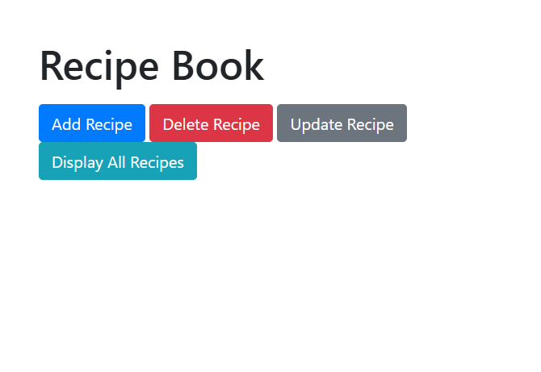
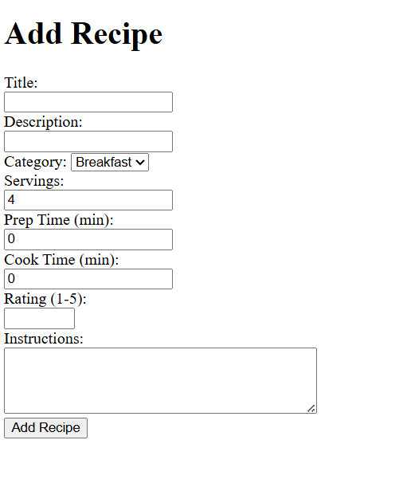
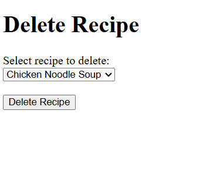
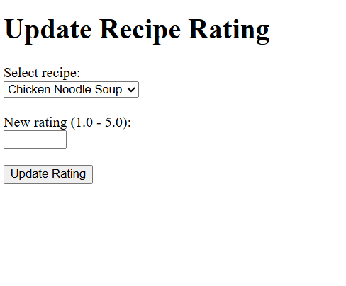
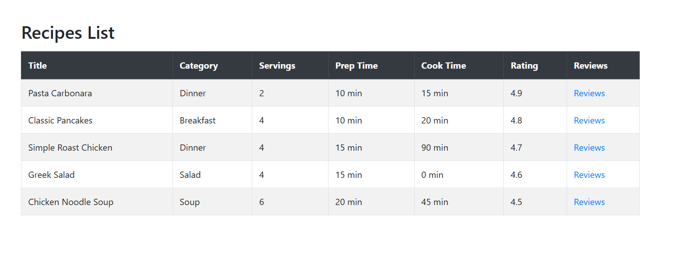
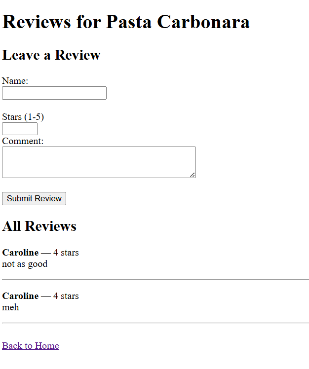

# Project 1: Recipe Book

**CS178: Cloud and Database Systems — Project #1**
**Author:** Caroline Cromley
**GitHub:** caroline-cromley

---

## Overview

My project is a recipe book that is able to add, delete, update ratings, and display all recipes. It is able to update the ratings/instructions for the recipes and store them via DynamoDB. Also, through the 'Display All Recipes' page, you are able to add a review to the recipes and view what other reviews were created for other people. This project can be used to create a recipe book for a family who may live in different places but would like a primary source location for everyone to share their favorite recipes.

---

## Technologies Used

- **Flask** — Python web framework
- **AWS EC2** — hosts the running Flask application
- **AWS RDS (MySQL)** — relational database storing recipes, categories, ingredients, and tags
- **AWS DynamoDB** — non-relational database storing user-submitted reviews for recipes
- **GitHub Actions** — auto-deploys code from GitHub to EC2 on push

---

## Project Structure

```
cs178-flask-app/
├── flaskapp.py            # Main Flask application — routes and app logic
├── dbCode.py              # Database helper functions (MySQL connection + queries)
├── creds.py               # References credentials needed to run flaskapp.py, not visible in GitHub (only locally)
├── screenshots            # Folder that includes variety of png screenshots of flask running to reference in README
├── templates/
│   ├── home.html          # Landing page
│   ├── add_recipe.html           # Form to add a new recipe
│   ├── delete_recipe.html # Dropdown to select and delete a recipe
│   ├── display_recipes.html# Table of all recipes with links to reviews
│   ├── reviews.html  # Submit and view reviews for a recipe (DynamoDB)
│   ├── update_recipe.html # Form to update a recipe's general rating
├── .gitignore             # Excludes creds.py and other sensitive files
├── schema.sql             # MySQL schema and data, created by Claude AI 
└── README.md
```
---
## How to Run Locally

1. Clone the repository:

   ```bash
   git clone https://github.com/caroline-cromley/cs178-flask-app.git
   ```

2. Install dependencies:

   ```bash
   pip3 install flask pymysql boto3
   ```

3. Set up your credentials (see Credential Setup below)

4. Run the app:

   ```bash
   python3 flaskapp.py
   ```

5. Open your browser and go to `http://127.0.0.1:8080`

---

## How to Access in the Cloud

The app is deployed on an AWS EC2 instance. To view the live version:

```
http://ec2-18-215-161-164.compute-1.amazonaws.com:8080/
```
---

## Credential Setup

This project requires a `creds.py` file that is **not included in this repository** for security reasons.

Create a file called `creds.py` in the project root with the following format:

```python
# creds.py — do not commit this file
host = "your-rds-endpoint"
user = "admin"
password = "your-password"
db = "your-database-name"
```

---

## Screenshots








---
## Database Design

### SQL (MySQL on RDS)

My RDS that I use was made by Claude AI. It is the schema.sql file in the folder. It includes several different tables that I used in the project. I chose not to use the ingredients tables, or any table related to the ingredient amount, as I thought that would take too long to test and add to the trials.


The recipe_tracker database has the following tables:

- categories — stores recipe categories (Breakfast, Dinner, etc.); primary key is id
- recipes — stores recipe details (title, description, servings, prep/cook time, rating, instructions); foreign key category_id links to categories
- ingredients — stores ingredient info including default unit and calories; primary key is id
- recipe_ingredients — join table linking recipes to ingredients with quantity and unit; foreign keys link to both recipes and ingredients
- tags — stores tags (ex: "vegetarian", "quick") linked to recipes via foreign key recipe_id


The JOIN query used in this project: The display-recipes route runs a JOIN between recipes and categories on category_id to display each recipe alongside its category name.

### DynamoDB

- **Table name:** RecipeReviews
- **Partition key:** recipe_id (number); links back to the recipe's MySQL ID
- **Sort key:** review_id (string); a unique id generated per review
- **Attributes:** reviewer_name, stars, comment
- **Used for:** Storing user-submitted reviews for recipes. When a user clicks "Reviews" next to a recipe, the app queries DynamoDB for all reviews with that recipe_id and displays them.

---

## CRUD Operations

| Operation | Route      | Description    |
| --------- | ---------- | -------------- |
| Create    | `/add-recipe` | Submits a form to insert a new recipe into MySQL |
| Read      | `/display-recipes` | Queries all recipes from MySQL with a JOIN and displays them in a table |
| Update    | `/update-recipe` | Selects a recipe and updates its rating in MySQL |
| Delete    | `/delete-recipe` | Selects a recipe from a dropdown and deletes it from MySQL |
| Create (NoSQL) | `/reviews/<id>` | Submits a review stored in DynamoDB |
| Read (NoSQL)   | `/reviews/<id>` | Retrieves and displays all reviews from DynamoDB |

---

## Challenges and Insights

The hardest part of the project was configuring the AWS networking because my RDS instance was in a private subnet with no internet gateway, so I could only connect it to EC2. This meant all testing had to happen through GitHub Actions auto-deploy pipeline rather than running Flask locally. I learned that VPC networking (subnets, security groups, internet gateways) matters a lot for how services communicate.

Another challenge was that MySQL and DynamoDB use completely different query patterns. MySQL uses structured SQL with JOIN statements, while DynamoDB uses key-based lookups. Keeping the two databases connected logically (using recipe_id as a shared key) was the solution I found to help this problem.

---

## AI Assistance

Claude AI was used throughout this project to:

- Generate the schema.sql database schema and seed data
- Help debug Flask routing errors and template rendering issues
- Generate some HTML for form templates (primarily the reviews.html)

Code that was generated/helped through AI are noted with a comment such as: "Claude AI was used to..."